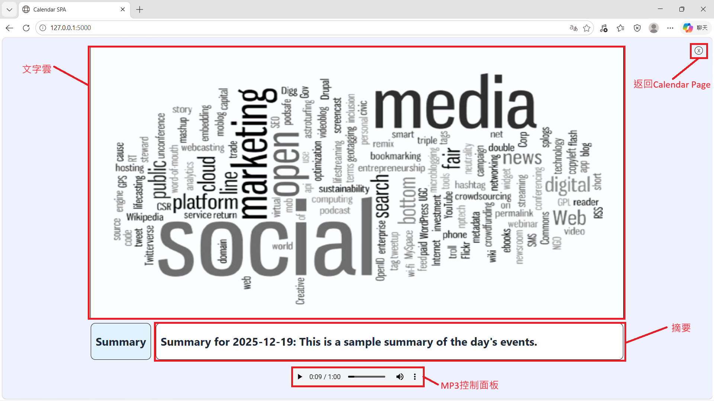

## 專案執行流程
### 建立環境
1. 下載專案
   
	```
 	git clone https://github.com/yos0727/nlp_final_project.git
 	```
 
2. 進入repo
   
	```
 	cd nlp_final_project
	```

3. 建立虛擬環境

	```
 	python -m venv .venv
 	.venv\Scripts\activate
 	```

 4. 安裝套件

	```
 	pip install -r requirements.txt
 	```

### 執行專案
1. 在終端輸入
   
	```
	python app.py
	```
3. 在瀏覽器輸入
   
	```
	http://127.0.0.1:5000
	```

## GUI操作說明
### Calendar Page

### Summary Page
